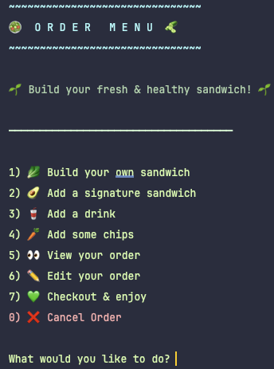

# 🥪 Nom Nom Deli

Nom Nom Deli is a Java-based CLI sandwich ordering system designed to simulate a customizable deli experience. Users can build their own sandwiches from a variety of healthy ingredients or choose from curated signature options. The app also allows users to add drinks, chips, view and edit their order, and generate a detailed receipt. This capstone project emphasizes object-oriented programming, clean input handling, file I/O, and unit testing.

---

## ✨ Features

- 🥖 Build-your-own sandwich with multiple bread, protein, cheese, veggie, and sauce options  
- 🌯 Select from three preset healthy signature sandwiches  
- 🧃 Add drinks and chips to complete your order  
- 🧾 Generates and saves detailed receipts to a file  
- 📜 Appends each order to a historical order log (`order_history.csv`)  
- ✅ Strong input validation to enhance user experience  
- 🎨 Stylized CLI output using ASCII art and colored text  
- 🧪 JUnit 5 unit tests covering all core classes  

---

## 🖼️ Screenshots

### 🏠 Home Menu  
Main entry point with stylized welcome message and intuitive navigation.


---

### 🧾 Order Menu  
Users can start building their order, add sandwiches, drinks, chips, or review their current order before checkout.



---

### 🧾 Receipt Example  
Receipts summarize order contents and total price, and are saved with a timestamped filename.


---

### 📜 Order History Log  
Keeps a historical record of all completed orders in a CSV file.


---

## 📂 Diagrams

The following UML diagram shows the core structure of the Nom Nom Deli application, including key classes and relationships.


---

## ✨ Interesting Code Snippet: Signature Sandwich Inheritance

Signature sandwiches extend the base `Sandwich` class and are constructed with predefined toppings. This leverages object-oriented inheritance while remaining flexible for future additions.

```java
public class GreenGoddessWrap extends SignatureSandwich {

    public GreenGoddessWrap() {
        super("8", "Lettuce Wrap", false);
        addTopping(new Meat("Hummus", false));
        addTopping(new Cheese("Feta", false));
        addTopping(new RegularTopping("Cucumber"));
        addTopping(new RegularTopping("Avocado"));
        addTopping(new RegularTopping("Spinach"));
        addTopping(new RegularTopping("Sprouts"));
        addTopping(new RegularTopping("Pesto"));
    }

    @Override
    public String getSignatureName() {
        return "Green Goddess Wrap";
    }
}
```

## 💡 Why it's Interesting
- 🧱 Follows solid OOP practices with inheritance and polymorphism
- 🥗 Makes the app easily extendable with new signature items
- 🧩 Encapsulates preset sandwich logic into dedicated classes
- ✅ Keeps business logic consistent with the base Sandwich implementation
